# 🧠 NeuroKinetIQ

### Real-Time AI Gym Coach & Pose Analyzer

> **Your form. Analyzed. Corrected. In real time.**

NeuroKinetIQ is a real-time AI fitness coaching platform that transforms an ordinary webcam into an intelligent workout assistant. Using **computer vision, pose estimation, geometric movement analysis, AI-generated feedback, and voice synthesis**, NeuroKinetIQ can understand exercise movements, count repetitions, evaluate posture, provide corrective coaching, and maintain workout history.

The project combines a polished **Vercel-hosted product experience** with a dedicated **Streamlit-based real-time AI engine**, creating a complete journey from product discovery and authentication to live exercise analysis and workout analytics.

<p align="center">

[](https://www.python.org/)
[](https://streamlit.io/)
[](https://ai.google.dev/edge/mediapipe/solutions/vision/pose_landmarker)
[](https://opencv.org/)
[](https://sqlite.org/)
[](https://groq.com/)
[](LICENSE)

</p>

---

## 🌐 Live Applications

NeuroKinetIQ is presented through two complementary layers that work together as one product.

| Layer                              | Purpose                                                       | Technology                           | Status  |
| ---------------------------------- | ------------------------------------------------------------- | ------------------------------------ | ------- |
| 🌐 **Landing & Product Dashboard** | Product presentation, user journey and application showcase   | HTML5, CSS3, Vercel                  | 🟢 Live |
| 🤖 **Real-Time AI Gym Coach**      | Webcam-based pose analysis, exercise tracking and AI coaching | Python, Streamlit, MediaPipe, OpenCV | 🟢 Live |

### 🌐 Landing & Product Experience

**NeuroKinetIQ Landing Dashboard**
https://neurokinetiq-landing-dashboard.vercel.app/

A polished, responsive product experience designed to introduce NeuroKinetIQ, communicate its capabilities, showcase the application workflow, and provide access to the live AI coach.

### 🤖 Real-Time AI Gym Coach

**NeuroKinetIQ AI Application**
https://neurokinetiq-ai-realtime-gym-coach.streamlit.app/

The actual real-time computer-vision application where webcam movement is analyzed, repetitions are counted, posture metrics are calculated, corrective feedback is generated, and workout data is recorded.

---

# 🎬 Product Journey

The following walkthrough demonstrates the complete NeuroKinetIQ experience — from entering the product to completing an AI-assisted workout session.

<p align="center">
  
</p>

### The experience

**Discover → Sign Up → Dashboard → Select Exercise → Configure Workout → Start Camera → Analyze Movement → Receive Feedback → Complete Workout → Review History**

NeuroKinetIQ is designed around a simple principle:

> **The user should focus on exercising. The system should focus on understanding the movement.**

---

# 🖼️ Product Gallery

The following screens represent the complete product journey and the most important user-facing states.

## 🔐 01 — Authentication

<p align="center">
  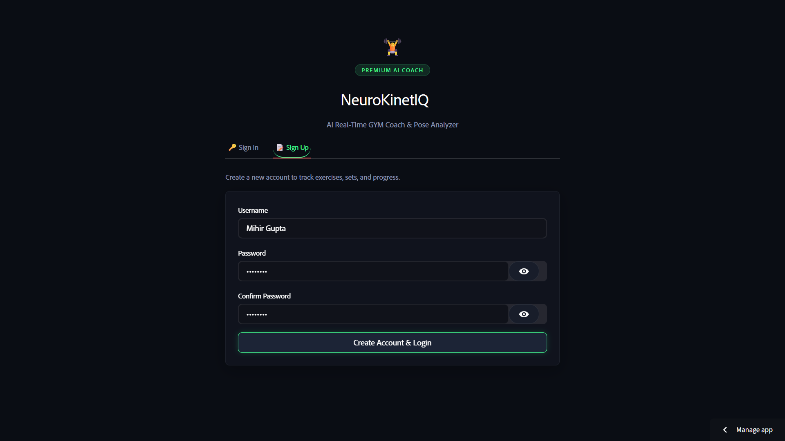
</p>

Secure account creation and authentication provide the entry point into the personalized workout experience.

---

## 🏠 02 — Home Dashboard

<p align="center">
  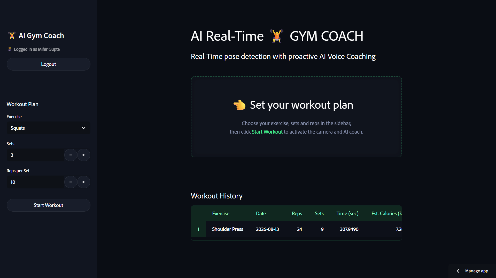
</p>

The central dashboard provides access to workouts, progress, exercise information and historical performance.

---

## 📊 03 — Exercises, Repetitions, Sets & History

<p align="center">
  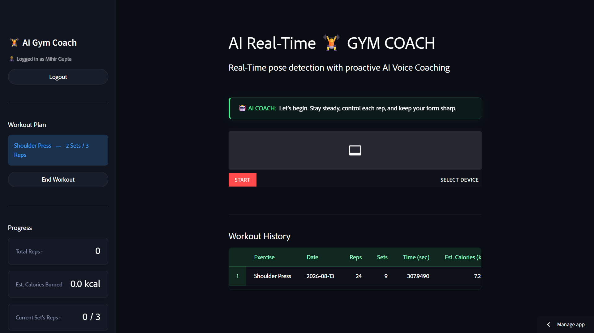
</p>

Workout information is organized into measurable metrics including exercises, repetitions, sets and historical activity.

---

## ▶️ 04 — Start Progress

<p align="center">
  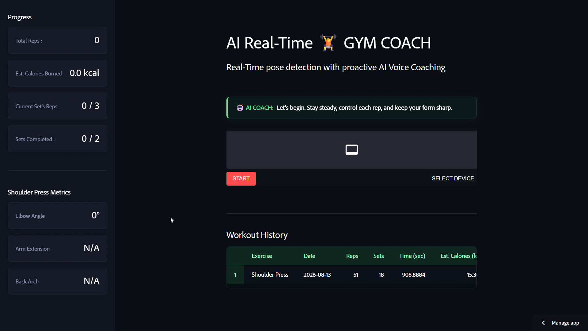
</p>

Users configure and begin their workout before entering the real-time computer-vision experience.

---

## 🧠 05 — Real-Time Pose Metrics

<p align="center">
  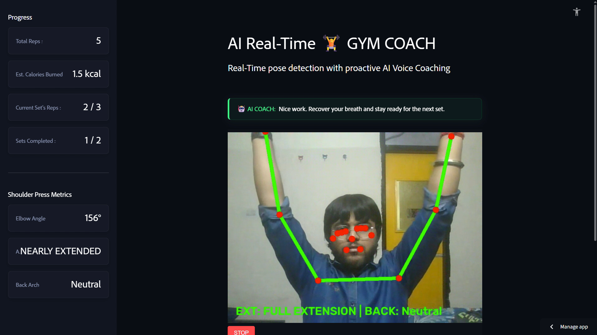
</p>

This is the core of NeuroKinetIQ: body landmarks and movement metrics are continuously analyzed while the user performs an exercise.

---

## 🏆 06 — Workout Complete

<p align="center">
  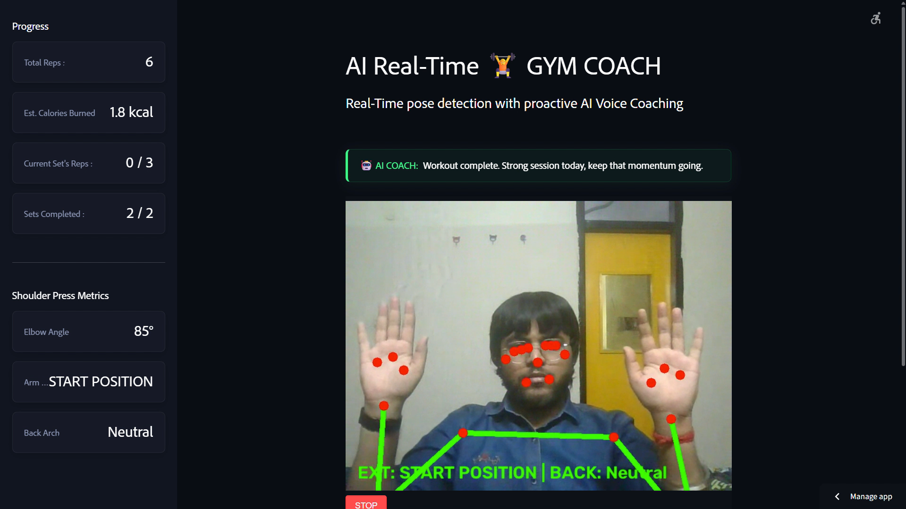
</p>

Once the target is reached, the session is finalized and workout metrics become part of the user's progress history.

---

## 💬 07 — Workout History & Feedback

<p align="center">
  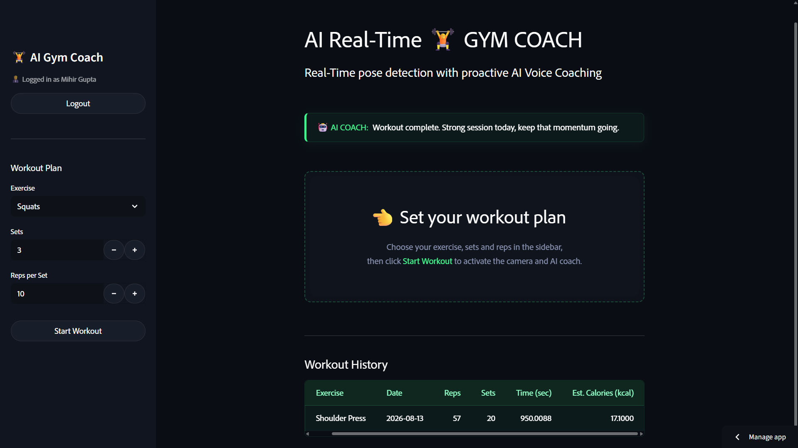
</p>

Historical sessions allow users to review completed workouts and the feedback associated with their training.

---

## 🌐 08 — Landing Page

<p align="center">
  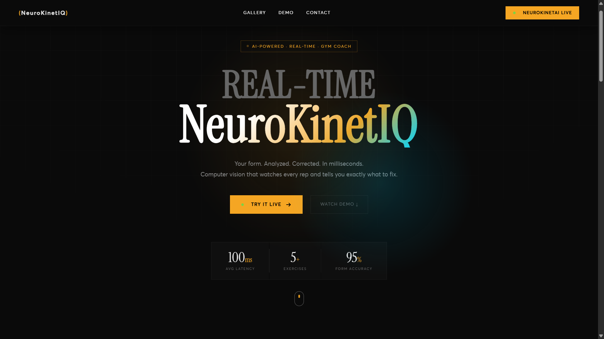
</p>

The Vercel-hosted landing experience introduces the product and communicates the complete AI fitness proposition.

---

## 🖼️ 09 — Gallery Section

<p align="center">
  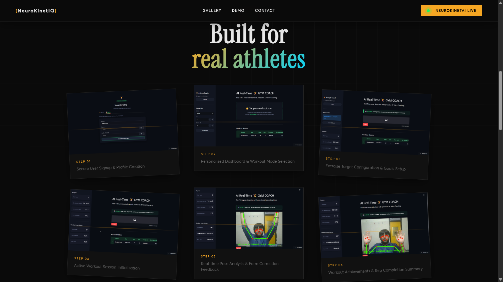
</p>

The showcase experience provides a visual overview of the application.

---

## 🎥 10 — Video Demo Section

<p align="center">
  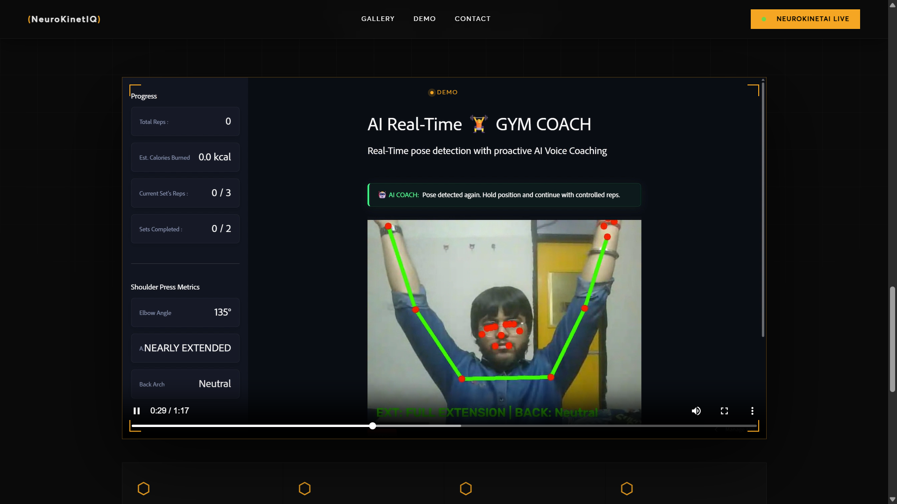
</p>

The product experience also provides an interactive demonstration of the real-time coaching workflow.

---

## 🤝 11 — Contact & Connections

<p align="center">
  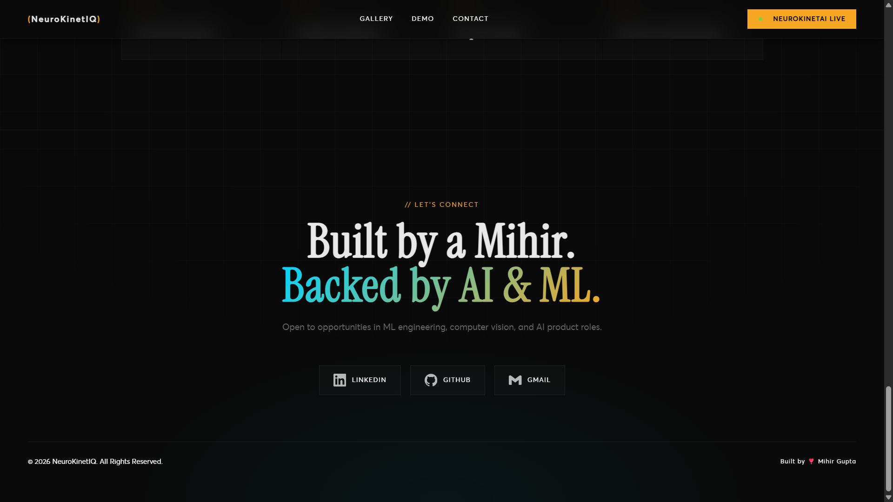
</p>

The final product section provides a direct connection point for users, collaborators and opportunities.

---

# ✨ Core Features

## 🧍 Real-Time Pose Detection

NeuroKinetIQ uses **MediaPipe Pose Landmarker** together with **OpenCV** to process webcam frames and identify important human body landmarks.

The system tracks movement around key regions including:

* Shoulders
* Elbows
* Wrists
* Hips
* Knees
* Ankles
* Torso

These landmarks form the foundation for downstream exercise analysis.

---

## 📐 Geometric Movement Analysis

Rather than treating the video as a simple image stream, NeuroKinetIQ converts detected body landmarks into meaningful geometric measurements.

Joint angles and positional relationships can be used to determine movement characteristics such as:

* Squat depth
* Knee positioning
* Elbow alignment
* Arm extension
* Back positioning
* Exercise phase

This converts raw visual information into measurable movement data.

---

## 🔢 Autonomous Repetition Counting

Exercise repetition counting is handled through movement-based state transitions.

Instead of simply detecting whether a person is visible, the system observes changes in relevant body measurements and determines when an exercise transitions through its required movement phases.

This helps prevent every detected frame from being incorrectly interpreted as a repetition.

---

## 🏋️ Exercise-Specific Form Analysis

Different exercises require different movement rules.

NeuroKinetIQ evaluates exercise-specific posture and movement conditions rather than applying one generic rule to every exercise.

Examples include:

* Squat depth and lower-body alignment
* Push-up elbow and body positioning
* Lunge movement
* Biceps curl arm movement
* Shoulder press movement

---

## 🎙️ Proactive AI Voice Coaching

When posture or movement deviates from defined conditions, NeuroKinetIQ can generate corrective guidance.

The feedback pipeline combines:

**Movement Metrics → AI Feedback Generation → Text → Speech → User**

Groq-powered LLaMA models provide fast AI-generated coaching responses, while **gTTS** converts generated feedback into audible instructions.

The goal is to make the feedback feel immediate enough to be useful during an active workout.

---

## 🔥 Calorie Estimation

NeuroKinetIQ estimates calories using exercise-specific metabolic assumptions.

Current per-repetition estimates include:

| Exercise              | Estimated kcal / rep |
| --------------------- | -------------------: |
| Squats                |                 0.40 |
| Push-ups              |                 0.35 |
| Lunges                |                 0.25 |
| Dumbbell Biceps Curls |                 0.15 |
| Shoulder Press        |                 0.30 |

These values are intended as **estimated workout metrics**, not medical-grade energy expenditure measurements.

---

## 📈 Workout History

Completed sessions are persisted so that users can review previous workout activity.

The system records relevant workout information such as:

* Exercise
* Repetitions
* Sets
* Calories
* Session history
* Feedback

---

## 🔐 Secure Authentication

User passwords are not stored as plain text.

NeuroKinetIQ uses:

**PBKDF2-HMAC-SHA256 + random salt + 100,000 iterations**

This provides a substantially safer authentication mechanism than storing raw passwords.

---

## 📱 Responsive Glassmorphic Interface

The AI application uses custom CSS to create a modern visual system featuring:

* Glassmorphic cards
* Translucent surfaces
* Blur effects
* Emerald highlights
* Responsive layouts
* Mobile-friendly tables
* Scrollable content areas
* Consistent visual hierarchy

---

# 🧠 How NeuroKinetIQ Works

At the center of the application is a real-time computer-vision pipeline.

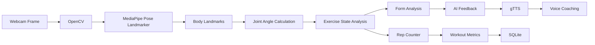

### In simplified terms:

```text
Camera
   ↓
Video Frame
   ↓
Pose Detection
   ↓
Body Landmarks
   ↓
Joint Angles / Position Metrics
   ↓
Exercise State
   ├── Rep Counter
   └── Form Analyzer
           ↓
      Corrective Feedback
           ↓
      Groq LLaMA
           ↓
          gTTS
           ↓
      Voice Coaching
           
Workout Metrics
        ↓
      SQLite
        ↓
   History / Dashboard
```

---

# ⚡ Real-Time Processing Flow

A typical workout session follows this sequence:

### 1. Camera Initialization

The user's webcam provides a continuous video stream.

### 2. Frame Processing

Frames are processed through the computer-vision pipeline.

### 3. Pose Landmark Detection

MediaPipe identifies relevant body landmarks.

### 4. Movement Measurement

The system derives geometric information such as joint angles and positional relationships.

### 5. Exercise Recognition / State Tracking

The relevant movement is interpreted according to the selected exercise's movement rules.

### 6. Repetition Validation

The state machine determines whether a complete repetition has occurred.

### 7. Form Evaluation

Relevant posture conditions are checked against exercise-specific thresholds.

### 8. Feedback Generation

When corrective feedback is required, the movement information is passed through the AI feedback layer.

### 9. Audio Feedback

Generated feedback can be converted into speech using gTTS.

### 10. Persistence

Workout metrics are synchronized with SQLite for historical tracking.

---

# 🏗️ System Architecture

NeuroKinetIQ consists of two primary product layers and a real-time AI processing layer.

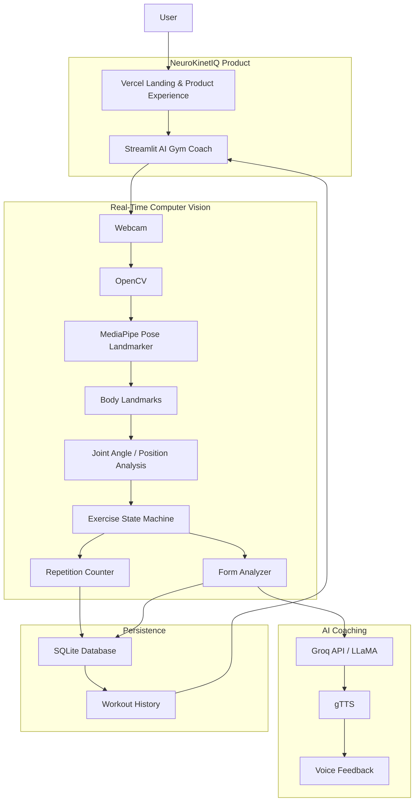

---

# 🔬 Technical Deep Dive

## 1. Pose Estimation

The computer-vision layer receives webcam frames and extracts human pose landmarks.

The important abstraction is:

```text
Image
  ↓
Pose Model
  ↓
Landmark Coordinates
  ↓
Geometric Measurements
  ↓
Exercise Logic
```

This allows the application to reason about **movement**, rather than simply recognizing the presence of a person.

---

## 2. Joint Angle Calculation

Joint angles are useful for determining the phase and quality of many exercises.

For three points:

```text
A -------- B -------- C
          Joint
```

the angle at `B` can be calculated from the vectors:

```text
BA = A - B
BC = C - B
```

and:

```text
angle = arccos(
    (BA · BC) / (|BA| × |BC|)
)
```

These measurements become useful signals for exercise-specific rules.

---

## 3. Repetition State Machines

Repetition counting is based on movement transitions rather than individual frames.

Conceptually:

```text
       START
         │
         ▼
   Initial Position
         │
         ▼
   Movement Begins
         │
         ▼
   Target Position
         │
         ▼
   Return Movement
         │
         ▼
      REP + 1
         │
         └──────────────► Next Rep
```

This state-based approach helps reduce false repetition counts caused by small frame-to-frame movements.

---

# 🗄️ Database & Persistence

NeuroKinetIQ uses **SQLite** for local persistence.

The database supports application requirements including:

* User authentication
* User records
* Workout sessions
* Exercise metrics
* Repetition data
* Set information
* Calorie estimates
* Workout history

---

## 🔄 SQLite Concurrency Protection

SQLite can temporarily report database-locking errors when multiple operations attempt to access the database concurrently.

NeuroKinetIQ addresses this with a transaction wrapper and retry mechanism.

```python
def execute_query(query_func):
    for attempt in range(1, 6):
        try:
            with sqlite3.connect(_DB_PATH) as conn:
                conn.row_factory = sqlite3.Row
                return query_func(conn)

        except (sqlite3.OperationalError, sqlite3.DatabaseError) as e:
            if "locked" in str(e).lower() or "busy" in str(e).lower():
                time.sleep(1.0)
            else:
                raise e
```

### Strategy

```text
Database Operation
       ↓
   Try Transaction
       ↓
   ┌── Success ──► Return
   │
   └── Locked/Busy
          ↓
      Wait 1 second
          ↓
       Retry
          ↓
       Maximum
       5 Attempts
```

This makes persistence significantly more resilient during concurrent application activity.

---

# 🔐 Authentication Security

Passwords are protected using salted PBKDF2-HMAC-SHA256 hashing.

```python
def hash_password(password: str) -> str:
    salt = secrets.token_hex(16)

    pwd_hash = hashlib.pbkdf2_hmac(
        "sha256",
        password.encode("utf-8"),
        salt.encode("utf-8"),
        100000
    ).hex()

    return f"{salt}:{pwd_hash}"
```

### Security properties

* Random per-password salt
* SHA-256 based PBKDF2
* 100,000 derivation iterations
* No plain-text password storage
* Salt stored alongside the derived password hash

The salt prevents identical passwords from producing identical stored hashes.

---

# 🧩 Engineering Challenges & Solutions

Building a real-time AI fitness application involves more than simply connecting a pose model to a webcam.

## Challenge 01 — Real-Time Video Processing

**Problem:**
Webcam processing must remain responsive while pose estimation and application logic execute continuously.

**Solution:**
The application uses a dedicated video-processing pipeline built around OpenCV and MediaPipe, while keeping the surrounding Streamlit interface lightweight.

---

## Challenge 02 — Reliable Repetition Counting

**Problem:**
Counting every frame as movement would produce incorrect repetition totals.

**Solution:**
Exercise-specific movement states and geometric thresholds are used to identify meaningful transitions and completed repetitions.

---

## Challenge 03 — Database Locking

**Problem:**
Concurrent SQLite access can cause `database is locked` or `database is busy` errors.

**Solution:**
A transactional wrapper retries locked operations up to five times with a one-second delay between attempts.

---

## Challenge 04 — Secure Authentication

**Problem:**
Storing passwords directly would expose user credentials.

**Solution:**
PBKDF2-HMAC-SHA256 with random salts and 100,000 iterations is used before storing credentials.

---

## Challenge 05 — Actionable Real-Time Feedback

**Problem:**
Fitness feedback needs to be understandable and immediate rather than simply displaying raw mathematical values.

**Solution:**
Movement metrics are transformed into human-readable corrective feedback, with Groq-powered LLaMA generation and optional gTTS voice output.

---

## Challenge 06 — Mobile-Friendly Interface

**Problem:**
Workout metrics and tables can become difficult to use on narrow screens.

**Solution:**
Custom responsive CSS, horizontal scrolling, flexible layouts and glassmorphic cards provide a consistent experience across viewport sizes.

---

# 🛠️ Technology Stack

| Category         | Technology                    | Role                        |
| ---------------- | ----------------------------- | --------------------------- |
| Language         | **Python 3.10+**              | Core AI application         |
| Web Application  | **Streamlit**                 | Interactive AI application  |
| Computer Vision  | **OpenCV**                    | Video processing            |
| Pose Estimation  | **MediaPipe Pose Landmarker** | Human pose tracking         |
| Generative AI    | **Groq / LLaMA**              | AI coaching feedback        |
| Speech           | **gTTS**                      | Text-to-speech feedback     |
| Database         | **SQLite3**                   | Application persistence     |
| Styling          | **Vanilla CSS**               | Glassmorphic responsive UI  |
| Product Showcase | **HTML5 / CSS3**              | Landing experience          |
| Deployment       | **Vercel**                    | Landing application hosting |
| Deployment       | **Streamlit Community Cloud** | AI application hosting      |

---

# 📁 Project Structure

## 🤖 Real-Time AI Application

```text
NeuroKinetIQ/
│
├── .streamlit/
│   └── config.toml
│
├── services/
│   ├── auth/
│   │   └── login_wall.py
│   │
│   ├── config/
│   │   └── workout_config.py
│   │
│   ├── persistence/
│   │   └── exercise_repository.py
│   │
│   ├── tracking/
│   │   └── metrics.py
│   │
│   └── vision/
│       └── excercise_video_processor.py
│
├── static/
│   └── style.css
│
├── main.py
├── packages.txt
├── requirements.txt
└── LICENSE
```

### Core modules

| Module                         | Responsibility                                        |
| ------------------------------ | ----------------------------------------------------- |
| `main.py`                      | Application routing and dashboard coordination        |
| `login_wall.py`                | Authentication and sign-in/sign-up flow               |
| `workout_config.py`            | Exercise configuration and workout constants          |
| `exercise_repository.py`       | SQLite persistence, authentication and retry handling |
| `metrics.py`                   | Workout metric synchronization                        |
| `excercise_video_processor.py` | OpenCV + MediaPipe real-time processing               |
| `style.css`                    | Responsive glassmorphic interface                     |

---

# 🌐 Landing & Product Showcase

The Vercel-hosted component provides the polished product-facing layer of NeuroKinetIQ.

```text
LandingPage/
│
├── IMGS/
│   ├── 1_Sign_up.png
│   ├── 2_Home_Page.png
│   ├── 3_Exercise_Reps_Sets_History.png
│   ├── 4_Start_Progress.png
│   ├── 5_Pose_Metrics_Updation.png
│   ├── 6_Workout_Complete.png
│   ├── 7_Workout_History_Feedback.png
│   ├── 8_Landing_Page.png
│   ├── 9_Gallery_Section.png
│   ├── 10_Video_Demo_Section.png
│   └── 11_Contact_Connections.png
│
├── videos/
│   └── NeuroKinetIQVideo.mp4
│
├── fonts/
├── favicon.svg
├── index.html
├── style.css
├── NeuroKinetIQVideoGIF.gif
├── vercel.json
└── README.md
```

The landing experience focuses on:

* Product positioning
* Visual storytelling
* Feature communication
* Application showcase
* Demo presentation
* Connection / contact experience
* Access to the live AI application

---

# 🚀 Local Installation

## Prerequisites

Before running the AI application locally, ensure you have:

* Python **3.10, 3.11 or 3.12**
* A working webcam
* Git
* A Groq API key

---

## 1. Clone the Repository

```bash
git clone https://github.com/mihirgupta665/NeuroKinetIQ.git
cd NeuroKinetIQ
```

---

## 2. Create a Virtual Environment

### Windows

```bash
python -m venv .venv
.venv\Scripts\activate
```

### macOS / Linux

```bash
python -m venv .venv
source .venv/bin/activate
```

---

## 3. Install Dependencies

```bash
pip install -r requirements.txt
```

---

## 4. Configure Environment Variables

Create a `.env` file in the project root:

```env
GROQ_API_KEY="your-groq-api-key-here"
```

Never commit API keys or other secrets to Git.

---

## 5. Run NeuroKinetIQ

```bash
streamlit run main.py
```

Then open:

```text
http://localhost:8501
```

---

# ☁️ Deployment

## 🌐 Landing Application — Vercel

The product showcase is deployed through Vercel.

Deployment flow:

```text
Landing Page Source
       ↓
     GitHub
       ↓
     Vercel
       ↓
Production Website
```

---

## 🤖 AI Application — Streamlit Community Cloud

The real-time AI application is deployed through Streamlit Community Cloud.

Deployment flow:

```text
Python Application
       ↓
     GitHub
       ↓
Streamlit Community Cloud
       ↓
Live AI Gym Coach
```

Production deployment requires the Groq API key to be configured securely through the deployment platform's secrets/environment configuration.

The application also includes `packages.txt` for required Linux system dependencies.

---

# 🔒 Production Considerations

### Camera permissions

Modern browsers require secure origins for webcam access. Production deployment therefore uses HTTPS.

### API credentials

The Groq API key should be supplied through environment variables or platform secrets rather than committed to source control.

### Database

SQLite provides lightweight persistence suitable for the current application architecture. A production-scale deployment with many concurrent users could migrate the persistence layer to a server-based relational database.

---

# 📊 Current Capabilities

| Capability                          | Status |
| ----------------------------------- | :----: |
| Real-time webcam processing         |    ✅   |
| Human pose estimation               |    ✅   |
| Joint-angle analysis                |    ✅   |
| Exercise-specific movement analysis |    ✅   |
| Repetition counting                 |    ✅   |
| Set tracking                        |    ✅   |
| Form feedback                       |    ✅   |
| AI-generated coaching               |    ✅   |
| Voice feedback                      |    ✅   |
| Workout history                     |    ✅   |
| Calorie estimation                  |    ✅   |
| User authentication                 |    ✅   |
| SQLite persistence                  |    ✅   |
| Responsive UI                       |    ✅   |
| Vercel deployment                   |    ✅   |
| Streamlit deployment                |    ✅   |

---

# 🔮 Future Roadmap

NeuroKinetIQ is designed as a foundation that can be expanded into a more comprehensive AI fitness platform.

### 🏋️ Expanded Exercise Library

Add additional exercises and exercise-specific form rules.

### 🧠 More Advanced Movement Intelligence

Improve movement understanding using temporal models and richer motion representations.

### 📊 Personalized Analytics

Introduce long-term performance trends, progress graphs and personalized recommendations.

### 🎯 Adaptive Training Plans

Generate workout plans based on user goals, performance and historical activity.

### 👤 Personalized Coaching

Adapt feedback intensity, exercise difficulty and recommendations to individual users.

### ☁️ Scalable Persistence

Move from local SQLite persistence to a production database architecture for larger-scale multi-user deployments.

### 📱 Dedicated Mobile Experience

Extend the platform into a dedicated mobile application for training outside the desktop environment.

---

# 🎯 Why NeuroKinetIQ?

Traditional fitness applications often tell users **what exercise to perform**.

NeuroKinetIQ focuses on another question:

> **Are you performing it correctly?**

By combining computer vision, geometric movement analysis and generative AI, the system attempts to close the gap between:

```text
Workout Instructions
        +
Human Movement
        +
Real-Time Analysis
        +
Corrective Coaching
        =
Intelligent Fitness Assistance
```

The webcam becomes more than a camera.

It becomes the interface between the user and an AI coach.

---

# 🎥 Demo

A complete walkthrough is available in the repository through:

**`NeuroKinetIQVideo.mp4`**

The README also includes the optimized animated walkthrough:

**`NeuroKinetIQVideoGIF.gif`**

---

# 👨‍💻 Author

### Mihir Gupta

**B.Tech CSE — Artificial Intelligence & Machine Learning**

NeuroKinetIQ was designed and developed as an end-to-end AI computer-vision project combining:

**Software Engineering + Computer Vision + Generative AI + Real-Time Systems + Product Design**

---

# 📄 License

This project is licensed under the **MIT License**.

See [`LICENSE`](LICENSE) for details.

---

<p align="center">

### 🧠 NeuroKinetIQ

**See the movement. Understand the form. Improve the workout.**

</p>
